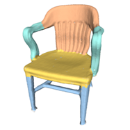
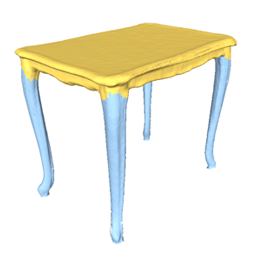
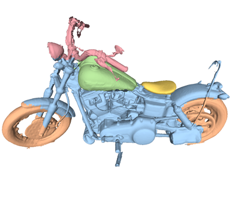

# Semantic-Object-Reconstruction
This is the source code of paper: Semantic Object Reconstruction via Casual Handheld Scanning

CONTACT (feel free to contact me):
cheng.wen.bupthu@gmail.com

Installation:
The code was developed on VS2015.

Requirements:
- DirectX SDK June 2010
- Kinect SDK (prev. to 2.0)
- NVIDIA CUDA 8.0 (for the CUDA implementation)
- PCL-1.8.0

Optional:
- Kinect SDK (2.0 and above)
- Prime sense SDK

Input: 
```
|--parent
      |--depth
      |--rgb
      |--label
```
images are organized as follows:
depthimage.png
colorimage.jpg
labelpart1.png
labelpart2.png
...
labelpartn.png

Some semantic reconstruction results:

<div align="left">



 </div>
